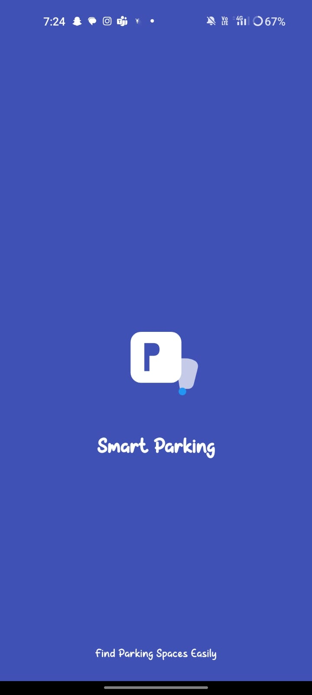
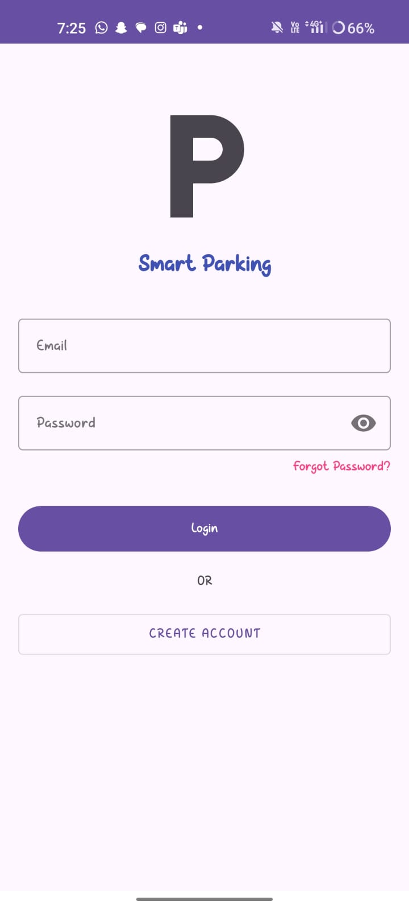
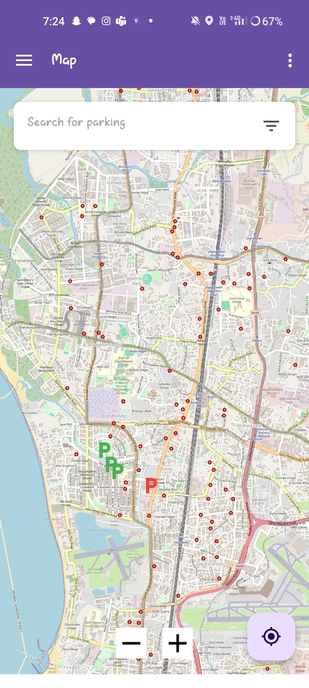
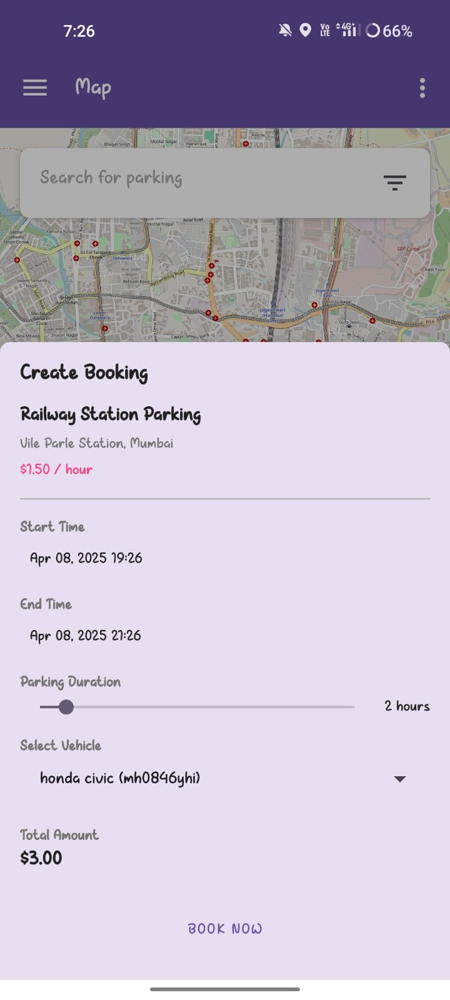
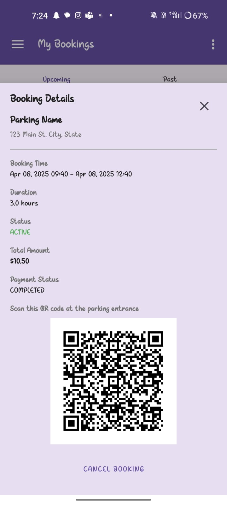
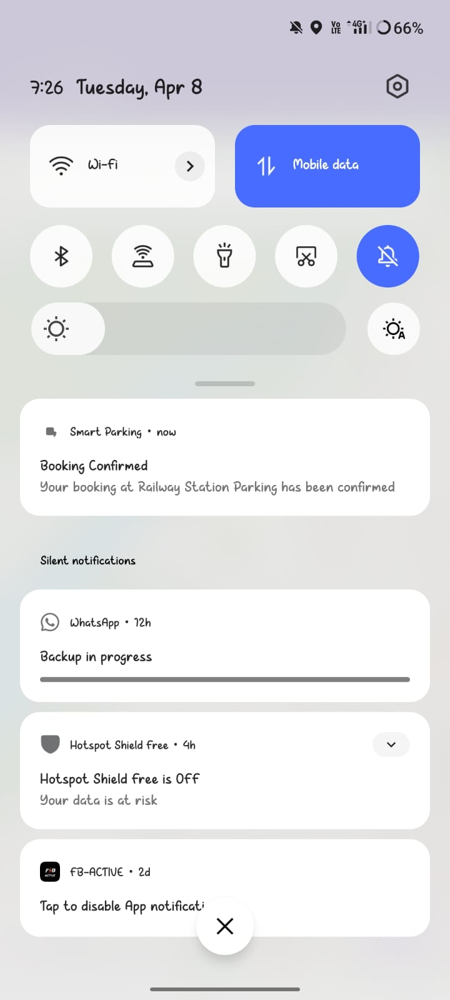

# Smart Parking App

A comprehensive mobile application that helps users find and book parking spaces in real-time. The app displays available parking spots on a map, allows users to make reservations, and manages their bookings efficiently.


## Features

- **Real-time parking availability**: View available parking spaces on an interactive map
- **Booking system**: Reserve parking spots in advance or on-the-spot
- **User accounts**: Register and manage your profile
- **Vehicle management**: Add and manage multiple vehicles
- **Booking history**: Track past and upcoming bookings
- **QR code access**: Use generated QR codes to access parking facilities
- **Notifications**: Receive reminders for bookings and expiry alerts

## Screenshots

<div style="display: flex; justify-content: space-between;">
  
  
  
  
  
  
</div>

## Technologies Used

- **Android Studio**: Primary development environment
- **Java**: Programming language
- **Firebase Authentication**: User authentication
- **Firestore Database**: Cloud-based NoSQL database
- **Room Database**: Local data persistence
- **OSMDroid**: Open-source maps implementation
- **MVVM Architecture**: Modern app architecture with ViewModels and LiveData
- **Navigation Components**: For fragment navigation
- **Material Design Components**: For consistent UI

## Installation

1. Clone this repository
   ```
   git clone https://github.com/yourusername/smart-parking-app.git
   ```

2. Open the project in Android Studio

3. Connect your Firebase project:
   - Create a new Firebase project at [Firebase Console](https://console.firebase.google.com/)
   - Add an Android app to your Firebase project
   - Download the `google-services.json` file and place it in the app directory
   - Enable Authentication and Firestore in your Firebase project

4. Build and run the application on your device or emulator

## Project Structure

```
app/
├── src/main/
│   ├── java/com/smartparking/
│   │   ├── activities/        # All app activities
│   │   ├── adapters/          # RecyclerView adapters
│   │   ├── fragments/         # UI fragments
│   │   ├── models/            # Data models
│   │   ├── receivers/         # Broadcast receivers
│   │   ├── repositories/      # Data repositories
│   │   ├── utils/             # Utility classes
│   │   ├── viewmodels/        # MVVM ViewModels
│   │   └── views/             # Custom views
│   └── res/                   # Resources (layouts, drawables, etc.)
└── build.gradle              # App level build configuration
```

## Requirements

- Android 10.0 (API level 30) or higher
- Google Play Services
- Internet connection
- Location services

## Future Enhancements

- Payment gateway integration
- Parking space owner portal
- Real-time parking space occupancy sensors integration
- Route planning and navigation
- Loyalty program and discounts
- Multi-language support

## Contributing

1. Fork the repository
2. Create your feature branch (`git checkout -b feature/amazing-feature`)
3. Commit your changes (`git commit -m 'Add some amazing feature'`)
4. Push to the branch (`git push origin feature/amazing-feature`)
5. Open a Pull Request

## License

This project is licensed under the MIT License - see the LICENSE file for details.

## Contact

Project Link: [https://github.com/yourusername/smart-parking-app](https://github.com/yourusername/smart-parking-app)

---

Note: This application is a demonstration project and not intended for commercial use without proper modifications and testing.
